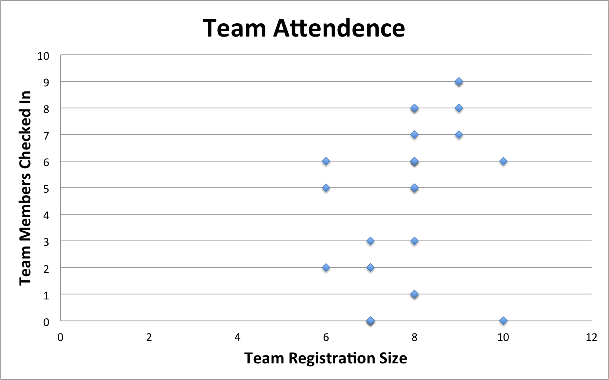
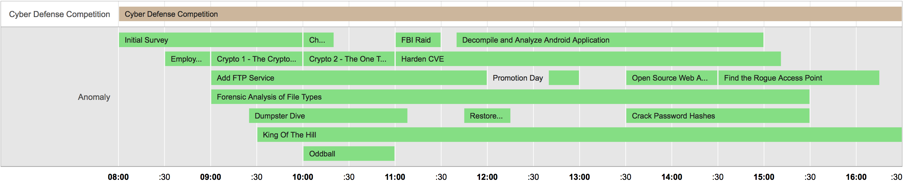
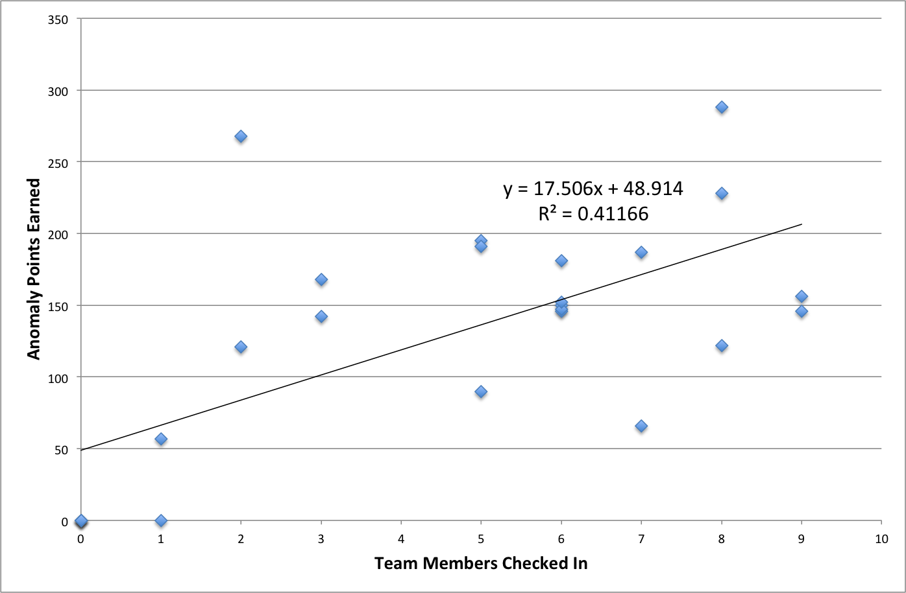

ISU Fall 2013 CDC Anomalies
===========================

This repository contains collection of the Iowa State University Fall 2013 Cyber Defense Competition anomalies and solutions where applicable.  The ISU CDC anomalies are optional challenges that may be completed by participating teams within the allocated challenge time frame to earn additional points during the competition.  Some anomalies are intentionally designed to provoke teams into performing an ill-advised operation that could potentially compromise the security of their network.  Other anomalies are simply technical or non-technical challenges designed to engage the participant during the competition.

These anomalies were created for the Iowa State University Fall 2013 Cyber Defense Competition held on September 21, 2013.  They are being released under the MIT License in the hopes that they can be reused or in some way aid in learning or promotion of computer security topics.  Aside from the `Initial Survey`, `Forensic Analysis of File Types`, and `King of the Hill` anomaly, which contained a vulnerable virtual machine for participants to attack (not released in this repository), the anomalies created in this repository were created by Ben Holland.

**Disclaimer:** The brief post-analysis of the CDC anomalies given below is the work of Ben Holland and does not reflect the views or opinions of Iowa State University.  A best effort was made to collect this data during and after the competition from participant registration, participant check in sheets, the competition scoreboard, and participant feedback.  As a result some of the data and analysis may be subject to errors.  Note also that some of the challenges contain security relevant materials that could be considered malicious by some.  Please use common sense when browsing this repository.

## Participation
The ISU Fall 2013 CDC had 25 teams register to compete in the Fall 2013 Cyber Defense Competition with varying team attendance on competition day.  As a result a few teams disbanded before competition day leaving 20 participating teams during the competition.

## Anomalies
The competition had a total of 18 anomalies.  For the majority of the competition multiple overlapping anomalies were active for teams to attempt.  Partial credit was given when grading submissions.

| Anomaly Name                               | Max Score | Required      | Released      | Expired  | Time Allowed        |
| -------------------------------------------|:---------:|:-------------:|:-------------:|:--------:|--------------------:|
| Initial Survey                             | 30        | Yes           | 8:00 AM       | 10:00 AM | 2 Hours              |
| Employee On-boarding                       | 10        | No            | 8:30 AM       | 9:00 AM  | 30 Minutes           |
| Crypto 1 - The Cryptonomicon               | 10        | No            | 9:00 AM       | 10:00 AM | 1 Hour               |
| Add FTP Service                            | 20        | No            | 9:00 AM       | 12:00 PM | 3 Hours              |
| Forensic Analysis of File Types            | 20        | No            | 9:00 AM       | 3:30 PM  | 6 Hours, 30 Minutes  |
| Dumpster Dive                              | 10        | No            | 9:25 AM       | 11:08 AM | 1 Hour, 43 Minutes   |
| King Of The Hill                           | 30        | No            | 9:30 AM       | 4:30 PM  | 7 Hours              |
| Charles Got Fired                          | 10        | No            | 10:00 AM      | 10:20 AM | 20 Minutes           |
| Crypto 2 - The One Time Pad                | 15        | No            | 10:00 AM      | 11:00 AM | 1 Hour               |
| Oddball                                    | 3         | No            | 10:00 AM      | 11:00 AM | 1 Hour               |
| FBI Raid                                   | 10        | No            | 11:00 AM      | 11:30 AM | 30 Minutes           |
| Harden CVE                                 | 30        | No            | 11:00 AM      | 3:11 PM  | 4 Hours, 11 Minutes  |
| Decompile and Analyze Android Applications | 30        | No            | 11:40 AM      | 3:00 PM  | 3 Hours, 20 Minutes  |
| Restore Services After FBI Raid            | 10        | No            | 11:45 AM      | 12:15 PM | 30 Minutes           |
| Promotion Day                              | 40        | No            | 12:40 PM      | 1:00 PM  | 20 Minutes           |
| Open Source Web App Again                  | 30        | No            | 1:30 PM       | 2:30 PM  | 1 Hour               |
| Crack Password Hashes                      | 10        | No            | 1:30 PM       | 3:30 PM  | 2 Hours              |
| Find the Rogue Access Point                | 30        | No            | 2:30 PM       | 4:15 PM  | 1 Hour, 45 Minutes   |

## Results
The anomalies `Employee On-boarding`, `Add FTP Service` and `Promotion Day` were designed to increase the attack surface area of the network and as a result many teams decided to strategically abstain from the challenge.  The `Open Source Web App Again` anomaly was designed to test teams on their ability to sanitize source code and the Red team was given a link to the source repositories created by the Blue teams that completed the challenge.  The remaining challenges were generally beneficial for teams to complete.  Some challenges were much more difficult than others and due to time constraints many teams did not submit all challenges.

| Anomaly Name                               | Percentage Teams Submitted | Average Percentage Earned For Submissions |
| -------------------------------------------|:--------------------------:|------------------------------------------:|
| Initial Survey                             | 100 %                      | 100 %                                     |
| Employee On-boarding                       | 80 %                       | 78.1 %                                    |
| Crypto 1 - The Cryptonomicon               | 45 %                       | 78.9 %                                    |
| Add FTP Service                            | 60 %                       | 91.7 %                                    |
| Forensic Analysis of File Types            | 95 %                       | 80 %                                      |
| Dumpster Dive                              | 90 %                       | 92.2 %                                    |
| King Of The Hill                           | 20 %                       | 54.2 %                                    |
| Charles Got Fired                          | 90 %                       | 72.2 %                                    |
| Crypto 2 - The One Time Pad                | 20 %                       | 50 %                                      |
| Oddball                                    | 85 %                       | 100 %                                     |
| FBI Raid                                   | 60 %                       | 77.5 %                                    |
| Harden CVE                                 | 30 %                       | 35.6 %                                    |
| Decompile and Analyze Android Applications | 45 %                       | 72.2 %                                    |
| Restore Services After FBI Raid            | 45 %                       | 88.9 %                                    |
| Promotion Day                              | 20 %                       | 25 %                                      |
| Open Source Web App Again                  | 55 %                       | 93.9 %                                    |
| Crack Password Hashes                      | 100 %                      | 74 %                                      |
| Find the Rogue Access Point                | 55 %                       | 87.9 %                                    |

The winning team had the most active participants and earned the highest total anomaly score.  The winning team was also notably efficient in the management of team resources.

Interestingly, however, the size of the team appeared to have little to no correlation to the total amount of points earned by the team from anomalies.  This is perhaps explained by teams that may have began to focus on anomalies as a way to recover points when other points were already lost by the Red team capturing flags or the team having services offline during regular service scans.  

